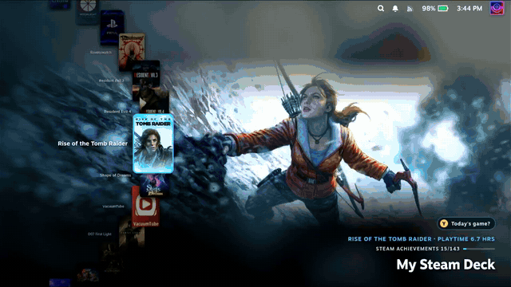

# Spindeck

**스팀덱 홈 화면을 대신하는 원형 휠 게임 런처예요.** 트랙패드를 원을 그리듯 문질러 라이브러리를 돌리고, 게임이 넘어갈 때마다 손끝으로 딸깍임을 느낄 수 있어요.

[English README](README.md) · [릴리스 노트](RELEASE_NOTES.md)

## 기능

- **휠 홈 화면:** 라이브러리가 화면 가장자리의 원형 휠에 놓이고, 반대편에 선택한 게임의 대표 이미지가 크게 보여요.
- **트랙패드 원형 회전:** 트랙패드를 원을 그리듯 문지르면 휠이 돌아가요. 문지르는 쪽 패드에서 스팀 원형 메뉴와 같은 진동이 울리고, 세기를 조절할 수 있어요.
- **L1 / R1 모음집:** L1은 ★ 즐겨찾기, R1은 내가 고른 모음집 하나를 열고, 반대쪽 버튼으로 돌아와요. 보기마다 마지막으로 고른 게임을 기억해요.
- **알파벳 팝업:** 전체 라이브러리를 알파벳순으로 볼 때 첫 글자가 바뀔 때와 빠르게 돌릴 때 큰 글자가 떠요.
- **오늘의 게임:** Ⓨ를 누르면 룰렛이 돌아서 무작위 게임에 멈춰요. 돌아가는 중에 Ⓨ를 다시 누르면 그 자리에서 멈춰요.
- **다이얼 오도미터:** 지금까지 돌린 바퀴 수를 세요. 빠른 설정의 '정보' 항목에서 볼 수 있고, 기념 숫자를 넘길 때마다 축하해 줘요.
- **나만의 문구:** 화면 구석에 "j1의 스팀덱" 같은 문구와 서브 문구를 넣을 수 있어요. 포인트 색상은 프리셋에서 골라요.
- **스팀 홈은 그대로:** ▼를 누르면 What's New / Friends / Recommended가 나와요. 원래 스팀 페이지처럼 동작해요.
- **영어·한국어:** 스팀 언어에 맞춰 바뀌어요. 빠른 설정 패널에서는 스팀 키보드로 한글이 입력되지 않아서, 전용 한글 자판을 넣었어요.

## 조작 (홈)

| 입력 | 동작 |
|---|---|
| 트랙패드 원형 문지르기 (기본: 왼쪽) | 휠 돌리기 |
| D패드 ◀ ▶ | 이전 / 다음 게임 |
| L1 | ★ 즐겨찾기 (패널에서 끌 수 있어요) |
| R1 | 패널에서 고른 모음집 하나 |
| Ⓐ | 게임 페이지 열기 |
| ≡ | 스팀 게임 메뉴 (플레이, 속성 등) |
| Ⓨ | 룰렛 "오늘의 게임은?" (Ⓨ 다시 누르면 정지) |
| D패드 ▲ | 검색 (원래 홈처럼) |
| D패드 ▼ | What's New / Friends / Recommended |
| 그 화면 맨 위에서 ▲ | 휠로 돌아가기 |
| 그 화면에서 Ⓑ | 맨 위로, 한 번 더 누르면 스팀 메뉴 |

설정은 빠른 설정(…) → Spindeck에 있어요. 홈 화면 사용, 문구·색상, 라이브러리 보기·정렬, 크기, 진동·효과음, 회전 트랙패드, 언어를 바꿀 수 있어요.

## 설치 (데키 개발자 모드)

Spindeck은 데키 스토어에 없어요. 이 저장소의 릴리스에서 설치해요.

1. 아직 없다면 [Decky Loader](https://decky.xyz)를 설치하세요.
2. 게임 모드에서 빠른 설정(…) → Decky → ⚙️ 설정 → **일반(General)** 으로 가서 **개발자 모드(Developer mode)** 를 켜세요.
3. **개발자(Developer)** 탭에서 둘 중 하나를 고르세요.
   - **Install Plugin from URL:** [최신 릴리스](https://github.com/justinca92/spindeck/releases/latest)의 `spindeck-x.y.z.zip` 링크를 붙여 넣어요.
   - **Install Plugin from ZIP:** 스팀덱에서 zip을 받은 뒤 그 파일을 골라요.
4. 빠른 설정 → Spindeck을 열면, 홈 화면이 바로 휠로 바뀌어요.

업데이트할 때는 새 버전 zip을 같은 방법으로 설치하면 돼요.

## 지우면 흔적이 남지 않아요

Spindeck은 스팀 설정, 컨트롤러 레이아웃, 스팀 파일을 바꾸지 않아요.

- **'휠 런처를 홈 화면으로'를 끄면** 원래 스팀 홈이 나와요.
- **플러그인을 끄거나 지우면** 트랙패드 입력 방식, 상단 바 스타일, 숨긴 줄이 즉시 전부 원래대로 돌아가요. 지울 때는 설정 파일도 삭제돼요.
- **스팀 업데이트로 플러그인이 기대는 부분이 바뀌면** 오류 대신 원래 스팀 홈이 나와요.

## 알려진 한계

- 패널의 한글 입력은 플러그인 전용 한글 자판을 써요. 스팀 화면 키보드가 빠른 설정 패널에는 빈 키 신호만 보내기 때문이에요.
- 스팀 내부 화면 구조에 기대고 있는데, 이건 공개 API가 아니에요. 스팀 업데이트로 바뀔 수 있고, 그러면 플러그인이 업데이트될 때까지 원래 스팀 홈으로 돌아가요.
- 스팀덱 OLED 게임 모드에서 테스트했어요.

## 후원

Spindeck은 무료 오픈소스예요. 마음에 드셨다면 [Ko-fi로 커피 한 잔](https://ko-fi.com/jhw0806) 사주세요 ☕. 플러그인 패널의 '정보' 항목에도 후원 버튼이 있어요.

버그 제보와 아이디어는 [Issues](https://github.com/justinca92/spindeck/issues)에 남겨 주세요.

## 만든 방법

Spindeck은 AI(Claude)의 도움을 받아 만들었어요. 기능 설계, 스팀덱 실기기 테스트와 조정, 무엇을 넣을지는 제가 직접 정했어요.

## 라이선스

[BSD-3-Clause](LICENSE)
